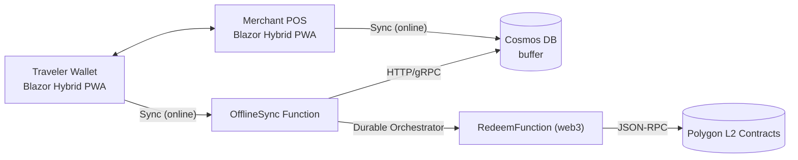

# Architecture Overview

```mermaid
flowchart LR
    T["Traveler Wallet<br/>Blazor Hybrid PWA"] <--> MP["Merchant POS<br/>Blazor Hybrid PWA"]
    T -- "Sync (online)" --> OSF["OfflineSync Function"]
    MP -- "Sync (online)" --> DB[("Cosmos DB<br/>buffer")]
    OSF -- "HTTP/gRPC" --> DB
    OSF -- "Durable Orchestrator" --> RF["RedeemFunction (web3)"]
    RF -- "JSON-RPC" --> PL[("Polygon L2 Contracts")]
```

Sequence diagrams and detailed data models are available in the Word specification and Appendix.