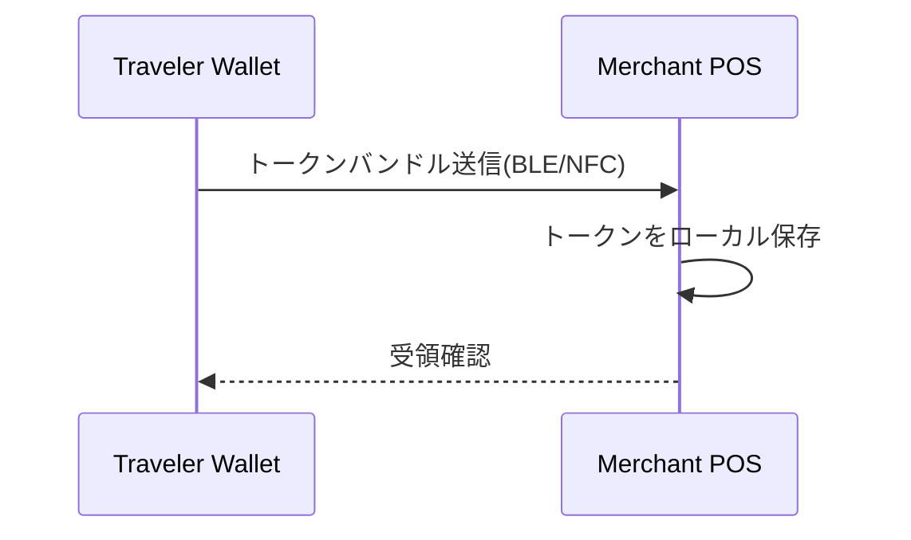
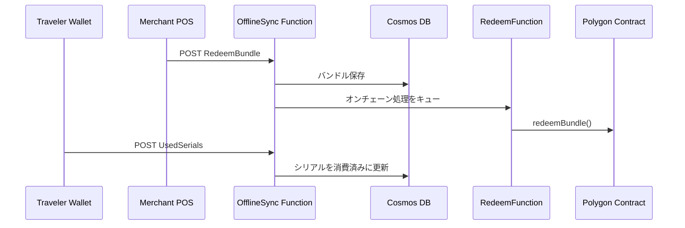

# オフライン決済とクラウド同期のフロー

このドキュメントでは、旅行者端末と加盟店端末がネットワークに接続されていない状態で決済を行う手順と、各端末がオンラインに戻った際にクラウドへ取引情報を同期する流れを示します。

## 1. 端末間のオフライン決済

## 2. オンライン同期

クラウド側でバンドルの検証とチェーンへの送信が完了すると、加盟店はオンチェーンでトークンを受け取ります。旅行者端末では消費済みトークンが記録され、二重支払いを防止します。

